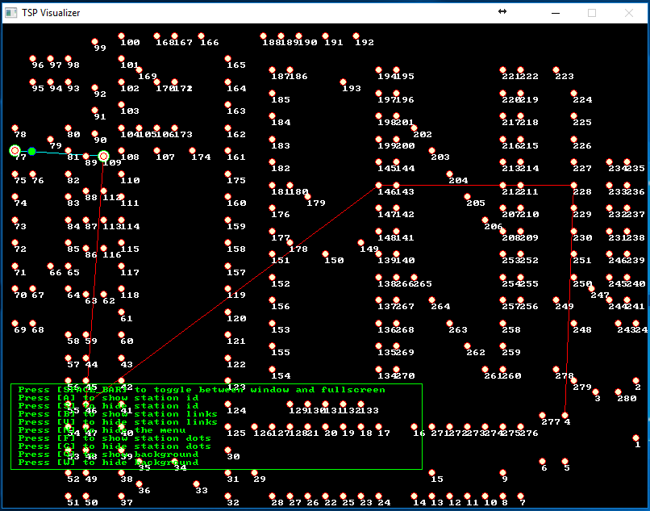

# allegro-visualizer-tsp

Travelling salesperson problem visualizer written using Allegro game library

# Usage 

git clone the project to your local computer, and open the solution file in either Visual Studio 2005, Visual Studio 2008 or Visual Studio 2010. Build the project, and the TSPVisualizer.exe built will be copied to the root directory of the project, you can run it (it will load the xml file tsp_gui.xml from the root directory and display the visulization result as shown below)

